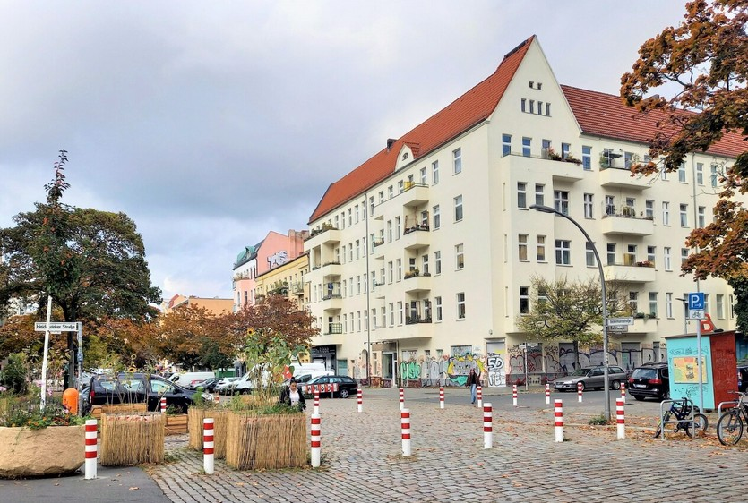
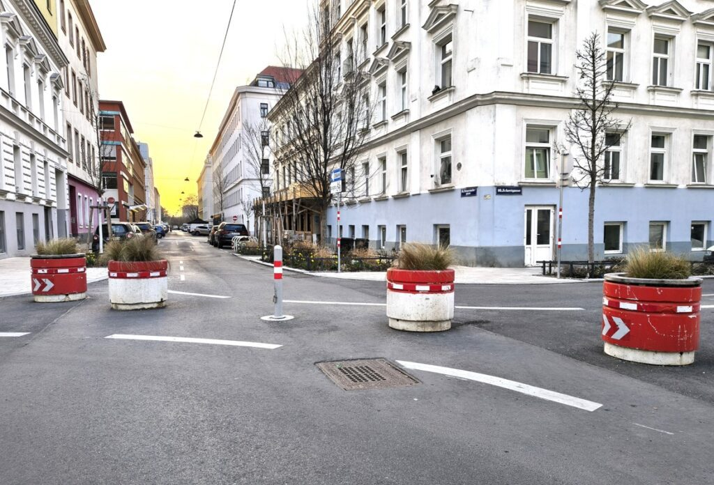

# **2** Kako začeti s superbloki

Superbloki zmanjšujejo tranzitni promet in ustvarjajo prostor za zadrževanje, hojo, kolesarjenje, ozelenitev in sosedsko življenje. Barcelona je koncept uveljavila mednarodno; Berlin je s Kiezblocks razvil različico, ki močno temelji na lokalnih pobudah; Dunaj ima kakovostno izvedbo v projektu Supergrätzl Favoriten in zdaj razpravlja o cenejših »soseskah z malo prometa«.

*Bellermannkiezblock v Berlin-Mitte. Fotografija: BA SGA Mitte, L. Fritsche.*

## Kaj se spremeni

Superblok ni zgolj posamezen kos urbane opreme ali projekt ozelenitve. Ključni vzvod je organizacija prometa:

- Tranzitni promet preprečujejo modalni filtri, enosmerne ulice, stebrički ali drugi ukrepi.
- Dostopni in dostavni promet ostajata mogoča, vendar potekata počasneje in pod neposrednejšim nadzorom.
- Površine v notranjosti postanejo uporabne za zadrževanje, poti v šolo, majhne odprte prostore, drevesa, sedišča in varna križišča.

*Supergrätzl Favoriten: stebrički, ponovno uporabljeni betonski sadilni obroči kot prometni filtri in nova drevesa. Fotografija: WirMachenWien 2026.*

## Kaj se lahko naučimo od Berlina

Changing Cities kaže, da pobude za superbloke na začetku ne potrebujejo popolnega načrta. Pomembno je, da lokalna skupina postane vidna in dolgoročno ohrani zmožnost ukrepanja. Berlinske pobude Kiezblock uporabljajo priročnike, svetovanje, štetje prometa, pogovore s podjetniki, preverjanje dejstev in zamisli za akcije.

Dunajska različica tega pristopa je: ne čakajte na dokončan celovit načrt, temveč opredelite jasno območje, razumljiv problem in prve zaveznike.

## Začetek v sedmih korakih

1. Določite območje: Izberite sosesko, v kateri lahko jasno opredelite tranzitni promet, poti v šolo, vročino, manjkajoča drevesa ali nevarna križišča.
2. Dokažite problem: Dokumentirajte opažanja, fotografije, konfliktne točke in po možnosti štetje prometa.
3. Oblikujte osrednjo ekipo: Določite vloge za raziskovanje, stike s sosedstvom, družbena omrežja, stike s četrtjo in akcije.
4. Cilj izrazite preprosto: Na primer »brez tranzitnega prometa okoli šole« ali »varne poti in več prostora za zadrževanje v notranjosti soseske«.
5. Pripravite prvo skico: Uporabite osnovni zemljevid in preverite, kje bi bili mogoči modalni filtri, enosmerne ulice ali prostori za zadrževanje.
6. Gradite zavezništva: Nagovorite stanovalce, starše, šole, lokalna društva, trgovine in četrtne politike.
7. Javno predstavite zahtevo: Uporabite akcije, delo z mediji, peticije, predloge četrtnim organom ali odprta pisma, odvisno od političnih priložnosti.

## Igrive intervencije

Igrive intervencije pokažejo, kako drugače bi lahko uporabljali ulico. Sodelovanje je lahko preprosto: kreda, premična sedišča, začasne igre, ozelenitev, informacijske stojnice, ulični piknik ali vizualizacija s transparenti.

Pomembno je, da akcija ni le videti prijetna, temveč jasno izraža zahtevo: Kateri problem pokaže? Katero rešitev nakaže? Kdo naj nato ukrepa?

## Gradiva

- WirMachenWien: [Kako začeti pobude za superbloke](https://wirmachen.wien/how-to/how-to-superblock-initiativen-starten/)
- Changing Cities: [Kako do superbloka](https://changing-cities.org/wp-content/uploads/2024/07/How-to-Superblock-Changing-Cities.pdf)
- WirMachenWien in Radlobby Wien: [Superbloki za Dunaj](https://wirmachen.wien/wp-content/uploads/2026/04/WmW_und_Radlobby_Superblock_Workshop_20260321.pdf)
- WirMachenWien: [Igrive intervencije](https://wirmachen.wien/wp-content/uploads/2026/04/WmW-Spielerische-Interventionen-WS20260321.pdf)
- Radlobby in Geht-doch: [Osnovni zemljevid za superbloke](https://www.radlobby.at/superblock-grundkarte)

## Video

Javna stran delavnic omenja posnetke serije, vendar v pregledanem gradivu za to delavnico ni bilo preverljive povezave na YouTube. Povezavo dodajte sem, ko bo posnetek objavljen ali interno odobren za objavo.
