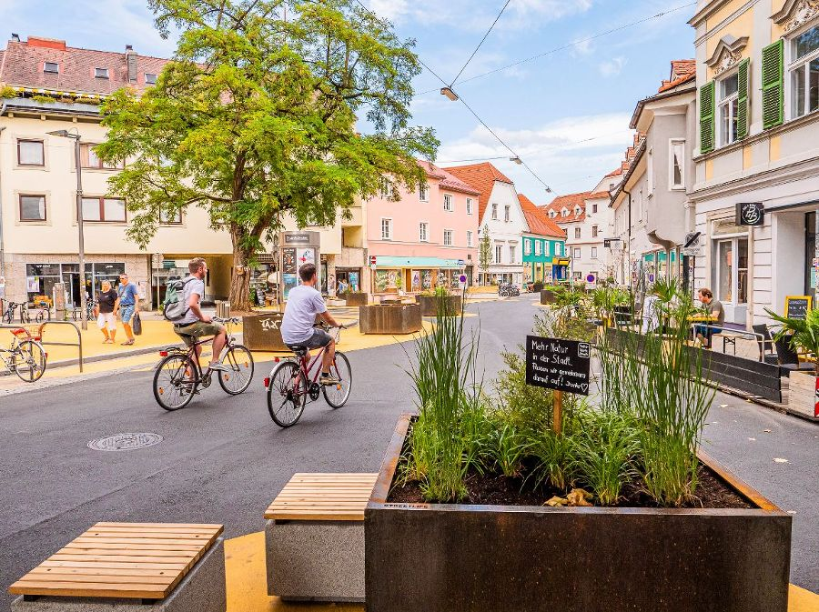
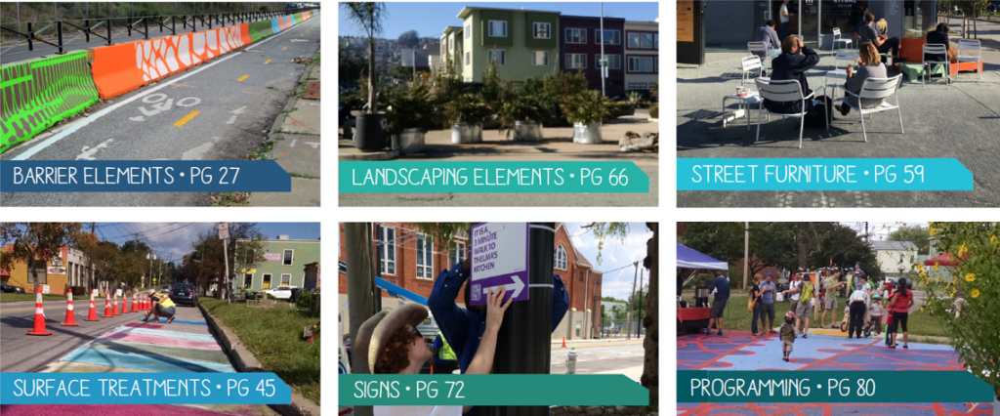
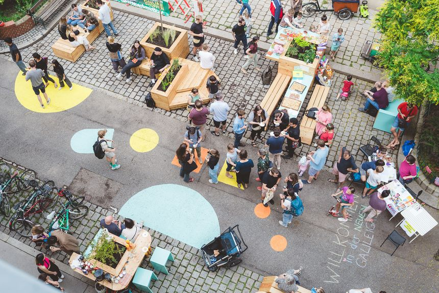

# **3** Taktični urbanizem in oblikovanje ulic

Taktični urbanizem pomeni poceni, začasne posege v mestni prostor, s katerimi lahko spremembe preizkusimo, jih pokažemo in politično pospešimo. Na Dunaju je to pomembno, ker mestna oblast razmišlja o taktičnem urbanizmu in »soseskah z malo prometa« kot cenejših oblikah umirjanja prometa.

*Lendplatz v Gradcu kot primer prometno umirjenih območij srečevanja z barvnimi oznakami. Fotografija: mesto Gradec, Simon Gostentschnigg.*

## Osnovna načela

Taktični urbanizem deluje posebej dobro, kadar je izpolnjenih pet pogojev:

- Ukrep je lokalno zasidran in rešuje konkreten problem.
- Izvedljiv je v kratkem času in z majhnim tveganjem.
- V malem pokaže dolgoročno spremembo.
- Gradi odnose med sosesko, pobudami, upravo in politiko.
- Ustvarja uporabne izkušnje: Kaj deluje, kaj je treba prilagoditi in kdo uporablja prostor?

## Šest orodij

Tactical Urbanism Guide in gradiva WirMachenWien navajajo šest preprostih skupin orodij:

- Ovire, kot so stebrički, betonski elementi ali sadilni obroči
- Ozelenitev in zasaditve
- Urbana oprema
- Oblikovanje površin z barvo
- Oznake in signalizacija
- Dogodki

Kakovost ni v samem predmetu, temveč v ustrezni uporabi: pobarvana površina je dobra le, če spremeni vedenje, olajša orientacijo ali prepričljivo predstavi novo rabo.

*Skupine orodij po priročniku Tactical Urbanism Guide organizacije Street Plans. Vir: Street Plans.*

## Dunajska stvarnost

Dunaj je močno reguliran. Predlagane rabe javnega prostora je treba preveriti in odobriti, zlasti pri pristojnih mestnih oddelkih, kot je MA 46 za organizacijo prometa in tehnične prometne zadeve. Pobude od spodaj zato potrebujejo ustrezno dovoljenje, sodelovanje s četrtjo ali mestom oziroma obliko akcije, ki je načrtovana skladno s pravom.

*TikTak Galilei v Galileigasse na Dunaju. Fotografija: Tim Dornaus.*

## Oblikovanje ulic kot skupinsko orodje

WirMachenWien uporablja delavnice oblikovanja ulic, da nezadovoljstvo pretvori v konkretne prostorske predstave. Module je mogoče uporabiti samostojno ali v kombinaciji:

- **Street Design Tisch:** Načrt ulice predelamo s papirjem, škarjami in pisali. Skupina razpravlja o rabah, potrebah po prostoru in različicah.
- **Street Banner:** Širino ulice vidno razdelimo, da pokažemo, koliko prostora bi lahko namenili hoji, kolesarjenju, zelenju ali zadrževanju.
- **Tree Love Set:** Premične vizualizacije dreves pokažejo, kje potrebujemo senco in ozelenitev.
- **Leiwander Straßen Radar:** Preprost popisni list pokaže kakovost življenja, varnost in potrebo po ukrepanju.
- **Street Shit Bingo:** Sprehod izostri pogled za ovire, nevarnosti in nesmiselno porazdelitev uličnega prostora.

## Potek lokalne delavnice

1. Izberite ulico ali križišče.
2. Zberite probleme: vročina, hrup, širina pločnika, prehodi, pritisk parkiranja, konflikti, manjkajoča sedišča ali zelene površine.
3. Izmerite prostor ali njegove mere razberite iz načrtov.
4. Pripravite različice: minimalno, drzno in dolgoročno.
5. Določite takojšnji ukrep: Katera začasna akcija najbolje pokaže zamisel?
6. Razjasnite vprašanja dovoljenj in zavezništev.
7. Po akciji dokumentirajte: fotografije, izjave, uporabo, medijski odziv in politične reakcije.

## Video



## Gradiva

- WirMachenWien: [Kako uporabljati taktični urbanizem na Dunaju](https://wirmachen.wien/how-to/how-to-tactical-urbanism-für-wien/)
- WirMachenWien: [Delavnica oblikovanja ulic](https://wirmachen.wien/blog/street-design-workshop-mit-wirmachenwien/)
- WirMachenWien: [Predstavitev taktičnega urbanizma](https://wirmachen.wien/wp-content/uploads/2026/05/Tactical_Urbanism_WirMachenWien_20260509.pdf)
- Remake Streets Wien: [Kako lahko barvne oznake spremenijo vedenje](https://wirmachen.wien/wp-content/uploads/2026/05/Remake_Streets_Wien_Sylvia_Kostenzer_6MB.pdf)
- WirMachenWien: [Delavnice oblikovanja ulic](https://wirmachen.wien/wp-content/uploads/2026/05/Street_Workshops_WirMachenWien_20260509.pdf)
- Street Plans: [Tactical Urbanism Guide](https://tacticalurbanismguide.com/)
